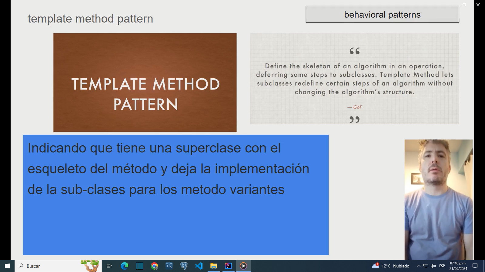
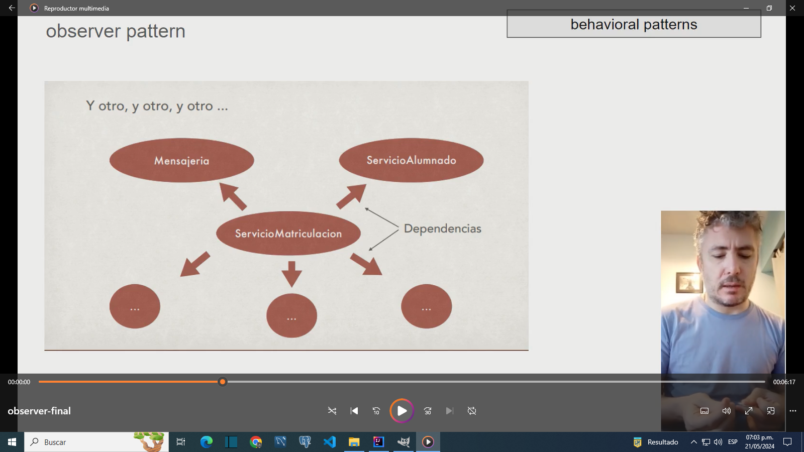

Didactic use of behavioral patterns

Chain of responsability pattern

Command pattern

Interpreter pattern

Iterator and visitor pattern

Mediator pattern

Memento pattern

State pattern

Strategy pattern

Template pattern

Observer pattern

